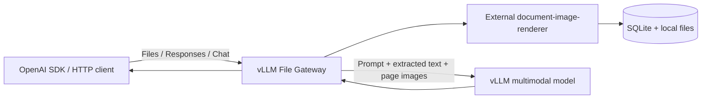

# vLLM File Gateway

> [!WARNING]
> 本プロジェクトはMVP実装です。評価・開発用途にのみ使用してください。

PDF、PowerPoint、Word、Excelを画像とテキストへ変換し、OpenAI互換APIからvLLMのマルチモーダルモデルへ入力するGatewayです。

vLLM単体では解決できないFiles APIの`file_id`やOffice文書をGatewayが処理し、ユーザーのプロンプト、抽出テキスト、ページ画像をResponses APIまたはChat Completions APIへ組み立て直します。元の文書ファイルやGatewayの`file_id`はvLLMへ渡しません。

## Features
- OpenAI互換の[Files API](https://developers.openai.com/api/reference/java/resources/files)
- OpenAI互換の[Responses API](https://developers.openai.com/api/reference/responses/overview)
- OpenAI互換の[Chat Completions API](https://developers.openai.com/api/reference/chat-completions/overview)
- `file_id`、base64の`file_data`、公開HTTPSの`file_url`入力

### Supported APIs

| API | Endpoint | Status |
| --- | --- | --- |
| Health | `GET /health` | Supported |
| Create file | `POST /v1/files` | Supported |
| List files | `GET /v1/files` | Supported |
| Retrieve file | `GET /v1/files/{file_id}` | Supported |
| Retrieve content | `GET /v1/files/{file_id}/content` | Supported |
| Delete file | `DELETE /v1/files/{file_id}` | Supported |
| Responses | `POST /v1/responses` | Synchronous requests only |
| Chat Completions | `POST /v1/chat/completions` | Synchronous requests only |
| Other vLLM APIs | `/v1/*` | Passed through to vLLM |

## How It Works



1. Files APIが文書を保存し、`status: "uploaded"`を返します。
2. バックグラウンドワーカーが文書をPNG画像とテキストへ変換します。
3. 変換完了後、Fileオブジェクトが`status: "processed"`になります。
4. ResponsesまたはChat Completionsのファイル参照を、テキストとdata URL画像へ展開します。
5. 展開後のリクエストを同種のvLLM APIへ転送します。

上記以外の`/v1/*`リクエストは、メソッド、クエリ、本文、Content-Typeを維持してvLLMへ転送します。Files APIのパスはGatewayが所有するため、未実装のメソッドをvLLMへ転送しません。

`file_data`と`file_url`はリクエストスコープで変換され、応答後に一時ファイルを削除します。Files APIでアップロードしたデータは作成から6時間保持されます。

## Requirements

- Python 3.10以降
- 文書画像変換の動作要件は[document-image-renderer](https://github.com/mochizuki875/document-image-renderer)を参照
- Responses APIまたはChat Completions APIで画像入力を処理できるvLLMサーバー

Gateway自体は特定モデル専用ではありません。
画像入力数、コンテキスト長、チャットテンプレートなどの制約は、使用するモデルとvLLM構成に合わせてください。

## Installation

リポジトリをcloneし、Python仮想環境へGatewayをインストールします。

```bash
git clone https://github.com/mochizuki875/vllm-file-gateway.git
cd vllm-file-gateway
python -m venv .venv
source .venv/bin/activate
python -m pip install -e .
```

Windows PowerShellでは、仮想環境を次のように作成して有効化します。

```powershell
python --version
python -m venv .venv
.\.venv\Scripts\Activate.ps1
python -m pip install -e .
```

設定ファイルを作成します。

```bash
cp .env.example .env
```
```
VLLM_MODEL=your-model-name
VLLM_BASE_URL=http://vllm-base-url:port/v1
GATEWAY_AUTH_REQUIRED=false
GATEWAY_API_KEY=your-gateway-api-key
VLLM_API_KEY=your-vllm-api-key
GATEWAY_DATA_DIR=./gateway-data
MAX_DOCUMENT_PAGES=20
MAX_DOCUMENT_IMAGES=8
```


<details><summary>Windows PowerShell</summary>

Windows PowerShellでは`Copy-Item .env.example .env`を使用します。
`.env`へvLLM接続情報と認証モードを設定します。

```dotenv
VLLM_MODEL=your-multimodal-model
VLLM_BASE_URL=http://your-vllm-host:8000/v1
GATEWAY_AUTH_REQUIRED=false
GATEWAY_API_KEY=
VLLM_API_KEY=
GATEWAY_DATA_DIR=./gateway-data
MAX_DOCUMENT_PAGES=20
MAX_DOCUMENT_IMAGES=8
```

</details>


## Running the Gateway

Gatewayを起動します。

```bash
python -m uvicorn gateway.main:app --host 0.0.0.0 --port 8080
```

別のターミナルからヘルスチェックします。

```bash
curl http://localhost:8080/health
```

`{"status":"ok"}`が返ればGatewayは起動しています。

## Docker

Composeはカレントディレクトリの`.env`を読み取り、vLLM接続情報とAPIキーをコンテナの環境変数へ渡します。

```bash
docker compose up --build -d
docker compose ps
curl http://localhost:8080/health
```

`docker compose ps`で`gateway`が`healthy`、`curl`で`{"status":"ok"}`が返ることを確認します。
停止する場合は次を実行します。

```bash
docker compose down
```

保存済みファイルとSQLiteデータベースはコンテナ内だけに保存され、コンテナを削除すると失われます。
公開ポートを変更する場合は、起動時に`GATEWAY_PORT=18080`のように指定できます。

## Configuration

| Environment variable | Required | Default | Description |
| --- | --- | --- | --- |
| `VLLM_MODEL` | Yes | None | クライアント要求とvLLM転送に使用するモデル名 |
| `VLLM_BASE_URL` | Yes | None | vLLMのOpenAI互換ベースURL。`/v1`で終わる絶対URL |
| `GATEWAY_AUTH_REQUIRED` | No | `false` | `true`の場合はGatewayでAPIキーを検証 |
| `GATEWAY_API_KEY` | Conditional | None | Gateway認証用キー。`GATEWAY_AUTH_REQUIRED=true`の場合は必須 |
| `VLLM_API_KEY` | Conditional | None | GatewayからvLLMへ送るキー。`GATEWAY_AUTH_REQUIRED=true`の場合は必須 |
| `GATEWAY_DATA_DIR` | No | `gateway-data` | SQLite、元ファイル、派生データの保存先 |
| `MAX_DOCUMENT_PAGES` | No | `20` | 1文書で変換可能な最大ページ数 |
| `MAX_DOCUMENT_IMAGES` | No | `8` | 1文書からvLLMへ送る画像の最大数。テキストは全ページ分を送信 |
| `FILE_TTL_SECONDS` | No | `21600` | ファイル保持秒数。現在は21600以外を拒否 |
| `MAX_FILE_BYTES` | No | `52428800` | 1ファイルの最大バイト数 |
| `REQUEST_TIMEOUT_SECONDS` | No | `300` | vLLMリクエストのタイムアウト秒数 |

`.env`はGit管理対象外です。秘密値を含まない[.env.example](.env.example)から作成してください。

## Usage

`GATEWAY_AUTH_REQUIRED`で次の2モードを選択できます。

- `false`（既定）: APIキーは任意です。受信した`Authorization`があればそのままvLLMへ転送し、なければ認証ヘッダーなしで転送します。認証の要否はvLLMが決定します。
- `true`: `GATEWAY_API_KEY`をクライアントへ要求してGatewayで検証し、vLLMへは`VLLM_API_KEY`を送ります。両方のキー設定が必須です。

`OPENAI_BASE_URL`にはGatewayのURLを指定します。`OPENAI_API_KEY`には、任意モードではvLLMのAPIキー、必須モードでは`GATEWAY_API_KEY`を指定します。

```bash
set -a
. ./.env
set +a

export OPENAI_BASE_URL=http://localhost:8080/v1
export OPENAI_API_KEY="$GATEWAY_API_KEY"
export OPENAI_MODEL="$VLLM_MODEL"
```

### OpenAI Python SDK

[example/openai_file_summary.py](example/openai_file_summary.py)は、`example/report.docx`をFiles APIへアップロードし、変換完了後にResponses APIで内容を要約します。
処理の成否にかかわらず、アップロードしたファイルの削除を試みます。

サンプル用の依存関係をインストールします。

```bash
python -m pip install -e '.[example]'
```

Gatewayを起動した状態で以下を実行します。
```bash
python example/openai_file_summary.py
```

実行結果:
```text
Uploaded: file_1d9aa0d6a8f64276827adfab4604e83c
Processed: file_1d9aa0d6a8f64276827adfab4604e83c
# Python実践入門：要約

## 概要
Pythonは1991年にGuido van Rossumが開発した高水準・汎用プログラミング言語。読みやすい構文、広大なエコシステム、高い開発生産性が特徴。

## 人気の理由
- **読みやすい構文**：インデントによるブロック構造
- **大規模エコシステム**：PyPIに多数のサードパーティ製パッケージ
- **クロスプラットフォーム**：Linux・Windows・macOSなどで動作
- **迅速な開発**：動的型付け、対話型インタープリタ、豊富な標準ライブラリ

## 基本構文とデータ型
- インデントでブロックを定義（波括弧なし）
- 型宣言は不要（型ヒントは任意）
- 主要なデータ型：int、float、str、bool、list、tuple、dict、set、None

## 関数・モジュール・OOP
- `def`キーワードで関数定義、型アノテーション対応
- クラスによるオブジェクト指向も可能だが、必須ではない
- 関数、モジュール、内包表記などのシンプルな設計が好まれる

## 環境管理
- `venv`による仮想環境と`pip`によるパッケージ管理が標準

## 主な用途
- Web開発（Django、Flask、FastAPI）
- データ分析・AI（NumPy、pandas、PyTorch、scikit-learn）
- 自動化・スクリプト、DevOps・クラウド、科学計算

## 長所とトレードオフ
- 開発生産性と表現力を最優先
- CPU負荷の高い処理ではC/C++/Rustより遅いが、ネイティブライブラリや非同期処理で補完可能

## 推奨ワークフロー
Python 3の導入 → プロジェクトごとに仮想環境作成 → 依存関係管理（pyproject.toml）→ フォーマット・lint・テスト → シンプルで読みやすいコードを維持

**結論**：Pythonは小規模スクリプトから大規模本番システムまで対応できる、読みやすく実用的な言語。
Deleted: file_1d9aa0d6a8f64276827adfab4604e83c
```

### curl

次の例ではJSONの処理に`jq`を使用します。アップロード、変換完了待ち、Responses APIへの質問、削除を順に実行します。`DOCUMENT`には手元のPDF、PPTX、DOCX、XLSXのパスを指定してください。

```bash
DOCUMENT=example/report.docx

# 1. 文書をアップロードし、返されたファイルIDを取得する(POST /files)
FILE_ID=$(curl --silent --show-error "$OPENAI_BASE_URL/files" \
  -H "Authorization: Bearer $OPENAI_API_KEY" \
  -F purpose=user_data \
  -F "file=@$DOCUMENT" | jq -r '.id')
echo "Uploaded: $FILE_ID"

# 2. 文書のアップロード確認(GET /files/{file_id})
# "status": "processed"となることを確認する
curl --silent --show-error "$OPENAI_BASE_URL/files/$FILE_ID" -H "Authorization: Bearer $OPENAI_API_KEY" | jq .

# 3. 変換済みの文書を指定してResponses APIへ質問する(POST /responses)
curl --silent --show-error "$OPENAI_BASE_URL/responses" \
  -H "Authorization: Bearer $OPENAI_API_KEY" \
  -H 'Content-Type: application/json' \
  -d "{\"model\":\"$VLLM_MODEL\",\"input\":[{\"role\":\"user\",\"content\":[{\"type\":\"input_file\",\"file_id\":\"$FILE_ID\"},{\"type\":\"input_text\",\"text\":\"この文章の内容を200文字程度で要約してください\"}]}]}" | \
  jq '{id, status, output_text: [.output[].content[] | select(.type == "output_text").text] | join("")}'

# 4. アップロードした文書を削除する(DELETE /files/{file_id})
curl --silent --show-error -X DELETE "$OPENAI_BASE_URL/files/$FILE_ID" \
  -H "Authorization: Bearer $OPENAI_API_KEY"
```

実行結果:
```text
Uploaded: file_1de626e84b0a4631b7f176d5c69f1d02
{
  "id": "file_1de626e84b0a4631b7f176d5c69f1d02",
  "object": "file",
  "bytes": 40578,
  "created_at": 1788710947,
  "expires_at": 1788732547,
  "filename": "report.docx",
  "purpose": "user_data",
  "status": "processed"
}
{
  "id": "resp_87aecd851c06dd90",
  "status": "completed",
  "output_text": "Pythonは1991年公開の高水準汎用言語。可読性の高い構文、豊富なライブラリ、クロスプラットフォーム対応が特徴で、インデントによるブロック表現や動的型付けを採用する。関数・クラス・仮想環境などの機能を持ち、Web開発、データ分析・AI、自動化、DevOpsなど幅広い分野で活用される。実行速度はC++等に劣るが、開発生産性と拡張性に優れ、初学者から大規模システムまで実用的な選択肢となる。"
}
{"id":"file_1de626e84b0a4631b7f176d5c69f1d02","object":"file","deleted":true}
```

### Input Forms

| API | Input | Shape |
| --- | --- | --- |
| Responses | Uploaded file | `{"type":"input_file","file_id":"file_..."}` |
| Responses | Inline base64 | `{"type":"input_file","filename":"document.pdf","file_data":"..."}` |
| Responses | Public URL | `{"type":"input_file","file_url":"https://example.com/document.pdf"}` |
| Chat Completions | Uploaded file | `{"type":"file","file":{"file_id":"file_..."}}` |
| Chat Completions | Inline base64 | `{"type":"file","file":{"filename":"document.pdf","file_data":"..."}}` |

`file_url`は公開HTTPS URLの443番ポートだけを許可します。ローカル、プライベート、予約済みIPアドレスへ解決されるURLは拒否します。

## Limits and Compatibility

- 対応形式は`.pdf`、`.pptx`、`.docx`、`.xlsx`です。
- 1ファイルの既定上限は50 MiBです。
- 1文書のページ数は`MAX_DOCUMENT_PAGES`で制限します。
- vLLMへ送る画像数は`MAX_DOCUMENT_IMAGES`で制限します。
- Files APIの`purpose`は`user_data`だけを受け付けます。
- Files APIは非同期です。推論前に`status: "processed"`を確認してください。
- `stream: true`は現在`400 unsupported_feature`を返します。
- `previous_response_id`は現在`400 unsupported_feature`を返します。
- ファイルcontent part以外のフィールドは同種のvLLM APIへベストエフォートで転送します。実際の対応状況はvLLMのバージョン、モデル、チャットテンプレート、ツールパーサーに依存します。
- OpenAI内部の文書変換、トークン使用量、回答品質との完全な一致は保証しません。
- Microsoft OfficeとLibreOfficeのレンダリング結果は一致しない場合があります。
- 単一Gatewayインスタンス、単一APIキー、ローカルSQLiteを前提としています。

## Security

- アップロードの拡張子と先頭シグネチャを検証します。
- `file_url`は公開HTTPSに限定し、非公開IPアドレスと過剰なリダイレクトを拒否します。
- 文書由来のテキストを信頼しないデータとしてモデルへ指示します。
- ログへ文書本文を明示的には出力しません。
- `.env`と`gateway-data/`をGit管理対象から除外しています。

任意モードのFiles APIはvLLMへリクエストしないため、APIキーを検証しません。Authorizationがある場合は、その値から導出したハッシュをファイル所有範囲の分離に使用します。Authorizationがないリクエストはすべて同じ匿名ファイルスコープを共有します。必須モードではFiles APIもGatewayで認証されます。

現在の実装には、コンテナ・プロセスレベルの完全なパーサー隔離、マルウェアスキャン、高可用構成、レート制限、保存時暗号化は含まれていません。インターネットへ公開する前に、リバースプロキシでTLS、認証、リクエストサイズ制限、レート制限を追加し、変換処理の隔離を強化してください。脆弱性を見つけた場合は、公開Issueへ機密情報や再現用文書を添付しないでください。

## Project Structure

```text
vllm-file-gateway/
├── pyproject.toml                 依存ライブラリとパッケージの設定
├── src/
│   └── gateway/                   FastAPI、Files管理、テキスト抽出、vLLM転送
├── example/                       OpenAI SDKの利用例と入力文書
├── tests/
│   └── test_app/                  GatewayのAPIテスト
├── DESIGN.md                      設計と実装境界
├── LICENSE                        Apache License 2.0
└── Dockerfile                     Gateway実行イメージ
```

`gateway`は外部の`document-image-renderer`が提供するPython APIを使用します。
依存関係は再現可能にするため、`pyproject.toml`で`v0.1.0`タグを指定しています。
Gateway固有のテキスト抽出、manifest生成、保存処理は`gateway`が担当します。

## Dev Container

`.devcontainer/`は、Python 3.10、LibreOffice、Liberation、Noto CJK、Carlitoを含む任意の開発環境です。
ホストへLibreOfficeやフォントをインストールしたくない場合は、VS CodeでリポジトリをDev Containerとして開いてください。
一般環境でのインストールとDocker実行にはDev Containerを必要としません。

## Testing

Gatewayの自動テストを実行します。vLLM呼び出しはモックされるため、GPUサーバーは不要です。

```bash
python -m pip install -e '.[test]'
python -m unittest discover -s tests/test_app -v
```

実機確認では、PDF、PPTX、DOCX、XLSXの変換と、ResponsesおよびChat Completionsの`file_id`、`file_data`、Responsesの`file_url`入力を確認しています。

## Contributing

IssueやPull Requestを歓迎します。変更は小さく保ち、関連するテストを追加または更新してください。文書変換結果を変更する場合は、外部ライブラリ、LibreOffice、フォント、PyMuPDFのバージョン差も考慮してください。

大きな機能追加やAPI互換性の変更は、実装前にIssueで目的と互換性への影響を共有してください。

## Documentation

- [Design document](DESIGN.md)

## License

Released under the Apache License 2.0.
See [LICENSE](LICENSE) for the full text.
