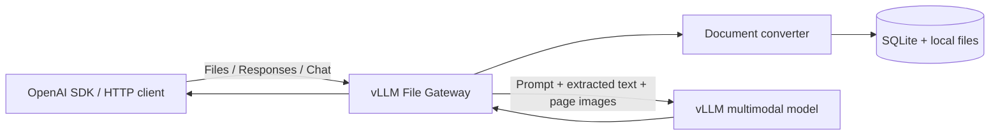

# vLLM File Gateway

> [!WARNING]
> 本プロジェクトはMVP実装です。評価・開発用途にのみ使用してください。

PDF、PowerPoint、Word、Excelを画像とテキストへ変換し、OpenAI互換APIからvLLMのマルチモーダルモデルへ入力するGatewayです。

vLLM単体では解決できないFiles APIの`file_id`やOffice文書をGatewayが処理し、ユーザーのプロンプト、抽出テキスト、ページ画像をResponses APIまたはChat Completions APIへ組み立て直します。元の文書ファイルやGatewayの`file_id`はvLLMへ渡しません。

## Features

- PDF、PPTX、DOCX、XLSXの非同期変換
- PyMuPDFによるPDFページ画像とテキストの生成
- LibreOfficeによるOffice文書のPDF化
- OpenAI互換のFiles API
- OpenAI互換のResponses APIとChat Completions API
- `file_id`、base64の`file_data`、公開HTTPSの`file_url`入力
- SQLiteとローカルファイルシステムによる状態管理
- Bearer認証とAPIキー単位のファイル分離
- アップロードから6時間後の自動失効・削除
- OpenAI Python SDKからの利用

### Supported APIs

| API | Endpoint | Status |
| --- | --- | --- |
| Health | `GET /health` | Supported |
| Create file | `POST /v1/files` | Supported |
| List files | `GET /v1/files` | Supported |
| Retrieve file | `GET /v1/files/{file_id}` | Supported |
| Retrieve content | `GET /v1/files/{file_id}/content` | Supported |
| Delete file | `DELETE /v1/files/{file_id}` | Supported |
| Responses | `POST /v1/responses` | Synchronous requests only |
| Chat Completions | `POST /v1/chat/completions` | Synchronous requests only |

## How It Works



1. Files APIが文書を保存し、`status: "uploaded"`を返します。
2. バックグラウンドワーカーが文書をWebP画像とテキストへ変換します。
3. 変換完了後、Fileオブジェクトが`status: "processed"`になります。
4. ResponsesまたはChat Completionsのファイル参照を、テキストとdata URL画像へ展開します。
5. 展開後のリクエストを同種のvLLM APIへ転送します。

`file_data`と`file_url`はリクエストスコープで変換され、応答後に一時ファイルを削除します。Files APIでアップロードしたデータは作成から6時間保持されます。

## Requirements

- Python 3.13
- LibreOffice Writer、Impress、Calc
- Noto CJKフォント
- Carlitoフォント
- Responses APIまたはChat Completions APIで画像入力を処理できるvLLMサーバー

Gemma 4で動作確認していますが、Gateway自体は特定モデル専用ではありません。画像入力数、コンテキスト長、チャットテンプレートなどの制約は、使用するモデルとvLLM構成に合わせてください。

## Quick Start

### Dev Container

VS CodeでリポジトリをDev Containerとして開き、依存関係をインストールします。

```bash
python -m venv .venv
./.venv/bin/pip install -r requirements.txt
cp .env.example .env
```

`.env`へvLLM接続情報とGatewayのAPIキーを設定します。

```dotenv
VLLM_MODEL=your-multimodal-model
VLLM_BASE_URL=http://your-vllm-host:8000/v1
VLLM_API_KEY=your-vllm-api-key
GATEWAY_API_KEY=change-this-gateway-key
GATEWAY_DATA_DIR=./gateway-data
MAX_DOCUMENT_IMAGES=8
```

Gatewayを起動します。

```bash
./.venv/bin/uvicorn gateway.app:app --host 0.0.0.0 --port 8080
```

別のターミナルからヘルスチェックします。

```bash
curl http://localhost:8080/health
```

### Docker

Composeはカレントディレクトリの`.env`を読み取り、vLLM接続情報とAPIキーをコンテナの環境変数へ渡します。

```bash
docker compose up --build -d
docker compose ps
curl http://localhost:8080/health
```

`docker compose ps`で`gateway`が`healthy`、`curl`で`{"status":"ok"}`が返ることを確認します。
停止する場合は次を実行します。

```bash
docker compose down
```

保存済みファイルとSQLiteデータベースはコンテナ内だけに保存され、コンテナを削除すると失われます。
公開ポートを変更する場合は、起動時に`GATEWAY_PORT=18080`のように指定できます。

Composeを使わずに起動する場合は次を実行します。

```bash
docker build -t vllm-file-gateway .
docker run --rm -p 8080:8080 \
  --env-file .env \
  -e GATEWAY_DATA_DIR=/var/lib/file-gateway \
  -v vllm-file-gateway-data:/var/lib/file-gateway \
  vllm-file-gateway
```

コンテナから到達できるURLを`VLLM_BASE_URL`へ指定してください。vLLMがホスト側で動作している場合、コンテナ内の`localhost`はvLLMホストを指しません。

## Configuration

| Environment variable | Required | Default | Description |
| --- | --- | --- | --- |
| `VLLM_MODEL` | Yes | None | クライアント要求とvLLM転送に使用するモデル名 |
| `VLLM_BASE_URL` | Yes | None | vLLMのOpenAI互換ベースURL。`/v1`で終わる絶対URL |
| `VLLM_API_KEY` | Yes | None | GatewayからvLLMへ送るBearerトークン |
| `GATEWAY_API_KEY` | Yes | None | クライアントがGatewayへ送るBearerトークン |
| `GATEWAY_DATA_DIR` | No | `gateway-data` | SQLite、元ファイル、派生データの保存先 |
| `MAX_DOCUMENT_IMAGES` | No | `8` | 1文書からvLLMへ送る画像の最大数。テキストは全ページ分を送信 |
| `FILE_TTL_SECONDS` | No | `21600` | ファイル保持秒数。現在は21600以外を拒否 |
| `MAX_FILE_BYTES` | No | `52428800` | 1ファイルの最大バイト数 |
| `REQUEST_TIMEOUT_SECONDS` | No | `300` | vLLMリクエストのタイムアウト秒数 |

`.env`はGit管理対象外です。秘密値を含まない[.env.example](.env.example)から作成してください。

## Usage

すべての`/v1`リクエストにGatewayのBearerトークンが必要です。

### OpenAI Python SDK

[samples/openai_file_response.py](samples/openai_file_response.py)は、アップロード、変換完了待ち、Responses API実行、削除までを行います。途中で失敗した場合も、アップロード済みファイルの削除を試みます。

次のコマンドは、Quick Startで作成した`.env`のAPIキーとモデル、およびリポジトリに同梱したPDFを使用します。Gatewayを起動した状態で、リポジトリのルートから実行してください。

```bash
set -a
. ./.env
set +a

OPENAI_BASE_URL=http://localhost:8080/v1 \
OPENAI_API_KEY="$GATEWAY_API_KEY" \
OPENAI_MODEL="$VLLM_MODEL" \
./.venv/bin/python samples/openai_file_response.py \
  samples/docs_input/samplefile.pdf \
  --prompt 'この文章の内容を200文字程度で要約してください'
```

実行結果:

```text
uploaded: file_c2832f673849417e90b09b0c6029b89d (status=uploaded)
processed: file_c2832f673849417e90b09b0c6029b89d
response:
Kubernetesは、コンテナ化されたアプリケーションの配置やスケーリングを自動化するオーケストレーション基盤です。「望ましい状態」を宣言し、それを維持するReconciliation（判別）という仕組みが核心です。主要なコンポーネント（Control Plane/Worker Node）やPod、Deployment、Serviceなどの基本リソースを活用し、監視・セキュリティ・安 全性などを設計に含めることが、安定した運用には不可欠です。
deleted: file_c2832f673849417e90b09b0c6029b89d (deleted=True)
```

### curl

次の一連のコマンドは、アップロード、変換完了待ち、Responses APIへの質問、削除を実行します。`FILE_ID`はアップロード結果から自動取得するため、手入力は不要です。

```bash
set -a
. ./.env
set +a

BASE_URL=http://localhost:8080/v1
DOCUMENT=samples/docs_input/samplefile.pdf

upload_response=$(curl --silent --show-error "$BASE_URL/files" \
  -H "Authorization: Bearer $GATEWAY_API_KEY" \
  -F purpose=user_data \
  -F "file=@$DOCUMENT")
printf '%s\n' "$upload_response"

FILE_ID=$(printf '%s' "$upload_response" | \
  python3 -c 'import json, sys; print(json.load(sys.stdin)["id"])')

while true; do
  file_response=$(curl --silent --show-error "$BASE_URL/files/$FILE_ID" \
    -H "Authorization: Bearer $GATEWAY_API_KEY")
  printf '%s\n' "$file_response"
  status=$(printf '%s' "$file_response" | \
    python3 -c 'import json, sys; print(json.load(sys.stdin)["status"])')
  case "$status" in
    processed) break ;;
    error) echo 'Document conversion failed.' >&2; exit 1 ;;
    *) sleep 0.5 ;;
  esac
done

response=$(curl --silent --show-error "$BASE_URL/responses" \
  -H "Authorization: Bearer $GATEWAY_API_KEY" \
  -H 'Content-Type: application/json' \
  -d "{\"model\":\"$VLLM_MODEL\",\"input\":[{\"role\":\"user\",\"content\":[{\"type\":\"input_file\",\"file_id\":\"$FILE_ID\"},{\"type\":\"input_text\",\"text\":\"この文章の内容を200文字程度で要約してください\"}]}]}")

printf '%s' "$response" | python3 -c '
import json
import sys

data = json.load(sys.stdin)
text = "".join(
    part.get("text", "")
    for item in data.get("output", [])
    for part in item.get("content", [])
    if part.get("type") == "output_text"
)
print(json.dumps({
    "id": data.get("id"),
    "status": data.get("status"),
    "output_text": text,
}, ensure_ascii=False, indent=2))
'

curl --silent --show-error -X DELETE "$BASE_URL/files/$FILE_ID" \
  -H "Authorization: Bearer $GATEWAY_API_KEY"
```

実行結果:

```text
{"id":"file_4bf10011f74b4a928f8b97f86dee3137","object":"file","bytes":127370,"created_at":1788451465,"expires_at":1788473065,"filename":"samplefile.pdf","purpose":"user_data","status":"uploaded"}
{"id":"file_4bf10011f74b4a928f8b97f86dee3137","object":"file","bytes":127370,"created_at":1788451465,"expires_at":1788473065,"filename":"samplefile.pdf","purpose":"user_data","status":"processed"}
{
  "id": "resp_bac8f045a335006c",
  "status": "completed",
  "output_text": "Kubernetesは、コンテナ化されたアプリケーションの配置や運用を自動化するオーケストレーション基盤です。「望ましい状態」を宣言し、それを継続的に維持するReconciliation（調律）という仕組みが核心です。Control PlaneやWorker Node、Pod、Deployment、Serviceといった要素で構成されます。実運用では、スケーリングや可用性、監視、セキュリティ、アップグレードを含めた設計が重要となります。"
}
{"id":"file_4bf10011f74b4a928f8b97f86dee3137","object":"file","deleted":true}
```

IDと時刻は実行ごとに変わります。GETリクエストに`-F`を指定するとcurlがPOSTとして送信するため、状態取得では`-F`を使用しません。

### Input Forms

| API | Input | Shape |
| --- | --- | --- |
| Responses | Uploaded file | `{"type":"input_file","file_id":"file_..."}` |
| Responses | Inline base64 | `{"type":"input_file","filename":"document.pdf","file_data":"..."}` |
| Responses | Public URL | `{"type":"input_file","file_url":"https://example.com/document.pdf"}` |
| Chat Completions | Uploaded file | `{"type":"file","file":{"file_id":"file_..."}}` |
| Chat Completions | Inline base64 | `{"type":"file","file":{"filename":"document.pdf","file_data":"..."}}` |

`file_url`は公開HTTPS URLの443番ポートだけを許可します。ローカル、プライベート、予約済みIPアドレスへ解決されるURLは拒否します。

## Limits and Compatibility

- 対応形式は`.pdf`、`.pptx`、`.docx`、`.xlsx`です。
- 1ファイルの既定上限は50 MiBです。
- 1文書は最大20ページまたは20生成画像です。
- vLLMへ送る画像数は`MAX_DOCUMENT_IMAGES`で制限します。
- Files APIの`purpose`は`user_data`だけを受け付けます。
- Files APIは非同期です。推論前に`status: "processed"`を確認してください。
- `stream: true`は現在`400 unsupported_feature`を返します。
- `previous_response_id`は現在`400 unsupported_feature`を返します。
- ファイルcontent part以外のフィールドは同種のvLLM APIへベストエフォートで転送します。実際の対応状況はvLLMのバージョン、モデル、チャットテンプレート、ツールパーサーに依存します。
- OpenAI内部の文書変換、トークン使用量、回答品質との完全な一致は保証しません。
- Microsoft OfficeとLibreOfficeのレンダリング結果は一致しない場合があります。
- 単一Gatewayインスタンス、単一APIキー、ローカルSQLiteを前提としています。

## Security

- アップロードの拡張子と先頭シグネチャを検証します。
- `file_url`は公開HTTPSに限定し、非公開IPアドレスと過剰なリダイレクトを拒否します。
- 文書由来のテキストを信頼しないデータとしてモデルへ指示します。
- ログへ文書本文を明示的には出力しません。
- `.env`と`gateway-data/`をGit管理対象から除外しています。

現在の実装には、コンテナ・プロセスレベルの完全なパーサー隔離、マルウェアスキャン、高可用構成、レート制限、保存時暗号化は含まれていません。インターネットへ公開する前に、リバースプロキシでTLS、認証、リクエストサイズ制限、レート制限を追加し、変換処理の隔離を強化してください。脆弱性を見つけた場合は、公開Issueへ機密情報や再現用文書を添付しないでください。

## Project Structure

```text
gateway/                  FastAPI、Files管理、文書変換、vLLM転送
samples/                  OpenAI SDKサンプルと評価用文書
tests/                    Gatewayの自動テスト
poc_image_convert/        画像変換の初期PoC
.devcontainer/            開発用コンテナ
DESIGN.md                 設計、互換性、段階的な拡張方針
Dockerfile                Gateway実行イメージ
```

`gateway`は`poc_image_convert`をimportせず、独立した実装として動作します。

## Testing

Gatewayの自動テストを実行します。vLLM呼び出しはモックされるため、GPUサーバーは不要です。

```bash
./.venv/bin/python -m unittest discover -s tests -v
```

PoCの変換回帰テストは別に実行できます。

```bash
cd poc_image_convert
../.venv/bin/python -m unittest -v test_convert_to_images.py
```

実機確認では、PDF、PPTX、DOCX、XLSXの変換と、ResponsesおよびChat Completionsの`file_id`、`file_data`、Responsesの`file_url`入力を確認しています。

## Contributing

IssueやPull Requestを歓迎します。変更は小さく保ち、関連するテストを追加または更新してください。文書変換結果を変更する場合は、LibreOffice、フォント、PyMuPDF、Pillowのバージョン差も考慮してください。

大きな機能追加やAPI互換性の変更は、実装前にIssueで目的と互換性への影響を共有してください。

## Documentation

- [Design document](DESIGN.md)
- [OpenAI SDK sample](samples/openai_file_response.py)
